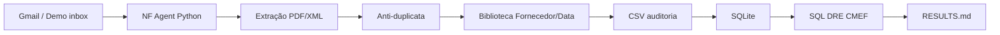

# Finance Ops Automation + NF Agent

[](https://www.python.org/)
[](https://www.sqlite.org/)
[](#nf-agent--demo-vs-produção)
[](#)
[](#testes)

**Analista de Dados/BI · Finanças · DRE · Automação operacional**

NF Agent (Python) + análise **DRE gerencial** (REAL / ORÇADO / EBITDA) com SQL reprodutível.  
Portfólio de **Denner Martins** — não é portfólio genérico de dashboard: é **problema de negócio + automação real + métricas auditáveis**.

> **Aviso:** dados **100% sintéticos** neste repo. Inspirado em automação corporativa real (Gmail + CMEF + DRE). Sem dados de empresas reais.

**English summary:** Production-inspired invoice automation agent (Python/Gmail API) with duplicate detection, audit CSV, and managerial P&L SQL analysis (budget vs actual, EBITDA, CMEF cost centers). Public demo uses synthetic data only.
---

## O problema

Áreas de **Comercial, Marketing e Experiência da Família (CMEF)** operam com:

- alto volume de notas fiscais por e-mail
- acompanhamento de **DRE gerencial** em painel de BI (REAL / ORÇADO / A-1)
- ajustes de orçado por linha de conta
- leitura de **EBITDA** e variações vs plano

> Este repositório **não replica o painel DRE corporativo** — ele demonstra a **lógica analítica** que o profissional aplica sobre esses indicadores, com dados 100% fictícios.

## Arquitetura



📖 Detalhes: [`docs/nf_agent_architecture.md`](docs/nf_agent_architecture.md) · [`docs/business_impact.md`](docs/business_impact.md) · [`docs/interview_pitch.md`](docs/interview_pitch.md)

---
| Etapa | Ferramenta |
|-------|------------|
| Captura NF-e | Python (demo local; produção: Gmail API) |
| Extração | lxml (XML) |
| Organização | `Fornecedor/AAAA.MM.DD/arquivo` |
| **Análise DRE** | SQL: REAL, ORÇADO, Δ R-ORÇ, A-1, EBITDA |
| **Linhas CMEF** | Marketing · Comercial · Exp. Família · Central Receitas |
| Auditoria | CSV + tickets de pagamento |

---

## NF Agent — Demo vs Produção

| Modo | Comando | Entrada |
|------|---------|---------|
| **Demo** (portfólio) | `python run_demo.py --reset` | XMLs fictícios em `demo/inbox/` |
| **Produção** (Gmail) | `python run_gmail.py` | Gmail API + OAuth |

📖 Arquitetura completa: [`docs/nf_agent_architecture.md`](docs/nf_agent_architecture.md)

**Produção real (anonimizado):** +5.900 registros · +1.900 NFs organizadas · 72 fornecedores

```bash
# Modo Gmail (opcional)
cp .env.example .env
pip install -r requirements-gmail.txt
# credentials/credentials.json → ver docs/nf_agent_architecture.md
python run_gmail.py
```

---

## Quick start (demo)

```bash
git clone https://github.com/dennerrmartins/finance-ops-automation.git
cd finance-ops-automation
pip install -r requirements.txt

# 1) Pipeline demo (gera XMLs fictícios + processa + CSV)
python run_demo.py --reset

# 2) Monta banco analítico
python create_database.py

# 3) Gera relatório SQL
python run_queries.py
```

Saídas:
- `output/planilhas/invoices_audit.csv`
- `output/notas/` — biblioteca organizada
- `database/finance_ops.db`
- `output/RESULTS.md`

---

## Estrutura do projeto

```
finance-ops-automation/
├── run_demo.py              # NF Agent — modo demo
├── run_gmail.py             # NF Agent — modo Gmail (produção)
├── create_database.py       # ETL → SQLite + DRE sintética
├── run_queries.py           # Gera RESULTS.md
├── nf_agent/                # Core do NF Agent
├── demo/                    # XMLs sintéticos
├── queries/                 # 5 módulos SQL (incl. DRE CMEF)
├── docs/
│   ├── nf_agent_architecture.md
│   ├── dre_indicators.md
│   └── case_study.md
└── output/                  # CSV, biblioteca, relatórios
```
---

## Modelo de dados

| Tabela | Descrição |
|--------|-----------|
| `suppliers` | Fornecedores mapeados às linhas CMEF da DRE |
| `invoices` | NF-e processadas (camada operacional) |
| `dre_accounts` | Plano de contas: SG&A → Vendas & Marketing → CMEF |
| `dre_performance` | REAL, ORÇADO e A-1 por conta/mês |
| `budget_lines` | Orçamento operacional por área |
| `payment_tickets` | Fluxo de pagamentos |

---

## Queries de negócio

| Módulo | Exemplos |
|--------|----------|
| 01 Fornecedores | Top gastos, concentração (camada operacional) |
| **02 DRE / CMEF** | **REAL vs ORÇADO, Δ R-ORÇ, drill-down SG&A** |
| **03 EBITDA** | **EBITDA S/ rateio, EBITDA Total, MG %, vs A-1** |
| 04 Pagamentos | Tickets, volume mensal de NFs |
| 05 Executivo | KPIs consolidados |

📖 Glossário dos indicadores: [`docs/dre_indicators.md`](docs/dre_indicators.md)

---

## Relação com projeto em produção

O **NF Agent** em produção:

- monitora Gmail em horários agendados
- extrai PDF/XML, detecta duplicatas (chave NF-e + hash MD5)
- organiza `Fornecedor/AAAA.MM.DD/arquivo`
- gera CSV auditável e alimenta tickets de pagamento

O analista **interpreta a DRE** no painel de BI (não modela o dashboard): REAL vs ORÇADO, A-1, EBITDA nas linhas CMEF.

Esta versão pública replica **arquitetura + lógica analítica** com dados fictícios.
---

## Testes

```bash
python -m unittest discover -s tests -v
```

Cobertura: extrator XML, anti-duplicata, organização de pastas.

---

## Como falar em entrevista

Roteiro pronto: [`docs/interview_pitch.md`](docs/interview_pitch.md)

---
- Python (ETL, automação, organização de arquivos)
- SQL (JOINs, CTEs, window functions, agregações)
- Finanças (orçado x realizado, EBITDA, contas a pagar)
- Documentação reprodutível (README + RESULTS.md + case study)

---

## Projetos relacionados

- [B3 Financial Analysis](https://github.com/dennerrmartins/b3-financial-analysis) — SQL + mercado de capitais

---

## Licença

MIT — uso educacional e portfólio.
